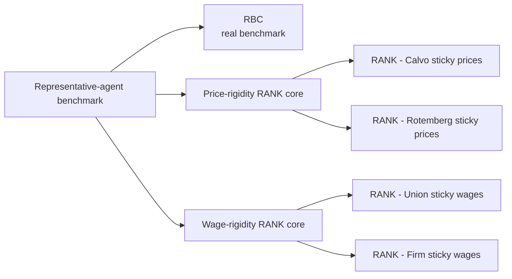
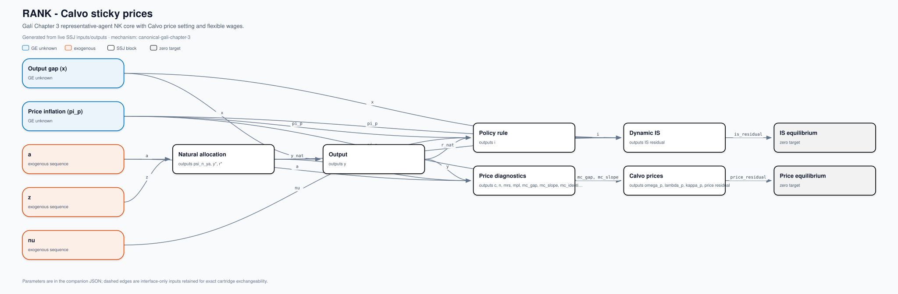
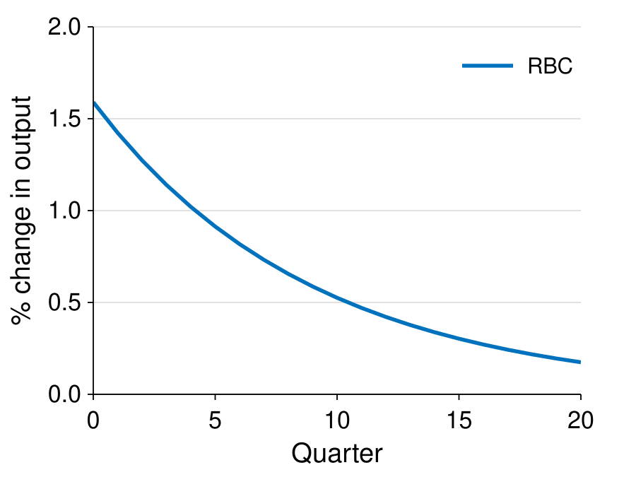
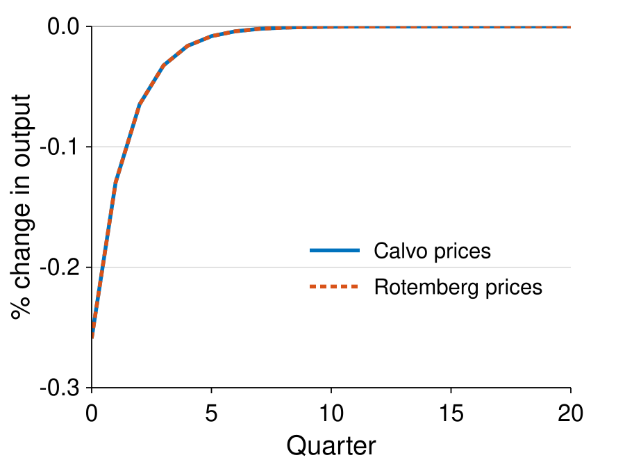
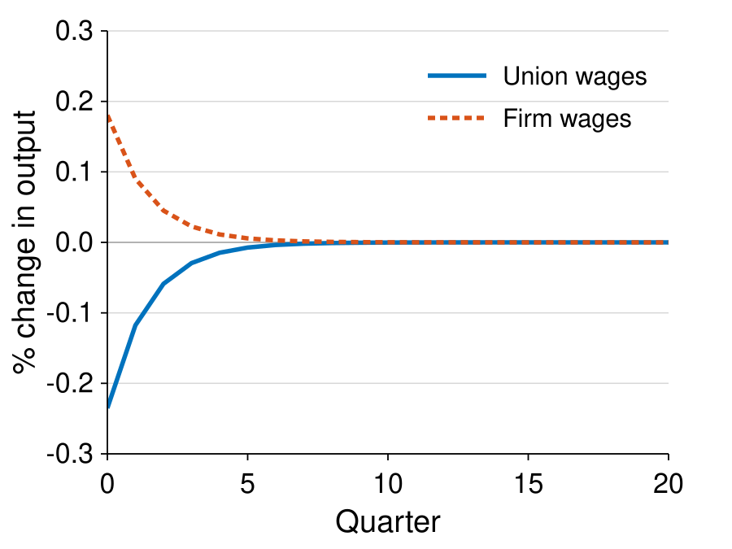

# SSJ RA-Blocks

An explicit five-model ladder for learning how representative-agent RBC and
New Keynesian models are assembled with the
[Sequence-Space Jacobian toolkit](https://github.com/shade-econ/sequence-jacobian):

1. `rbc` — the official SSJ RBC example.
2. `rank_calvo_sticky_prices` — canonical Galí Chapter 3 RANK with Calvo prices.
3. `rank_rotemberg_sticky_prices` — the same RANK core with Rotemberg prices.
4. `rank_union_sticky_wages` — flexible prices and sticky wages set by workers/unions.
5. `rank_firm_sticky_wages` — flexible prices and sticky wages set by firms.

This is a runnable teaching repository, not an API package. It has no Python
distribution metadata, editable-install workflow, package entry point, or
supported import surface. Run the one root script, then read the small internal
modules under `src/` alongside their generated DAGs.



## What “canonical” means here

| Model | Structural authority | Numerical status |
|---|---|---|
| `rbc` | Official SSJ RBC notebook | Exact upstream teaching normalization; `alpha=0.11` is not claimed to be universal |
| `rank_calvo_sticky_prices` | Galí (2015), Chapter 3 | Canonical quarterly textbook baseline |
| `rank_rotemberg_sticky_prices` | Standard first-order Rotemberg price adjustment | Adjustment cost is derived to match the Galí-Calvo slope; this is a matched normalization, not a Galí calibration |
| `rank_union_sticky_wages` | Erceg–Henderson–Levin worker/union wage setting, specialized to flexible goods prices | EHL structural benchmark plus an explicitly conventional policy closure |
| `rank_firm_sticky_wages` | Dennery employer wage setting and intertemporal labor supply | Direct mechanism with an empirical `eta=4` anchor; not presented as a canonical Dennery calibration |

Dennery derives the monopsony Phillips curve and the reversal in the relevant
intertemporal condition, but does not publish a unique numerical calibration.
That distinction is recorded in every generated audit JSON. The full
parameter-by-parameter map is in [docs/calibration.md](docs/calibration.md).

## Exchangeable blocks

There are two exact sockets:

| RANK core | Exchangeable cartridges | Fixed surroundings |
|---|---|---|
| Galí price-rigidity core | `price_calvo` ↔ `price_rotemberg` | Natural allocation, dynamic IS equation, Taylor rule, flexible wages |
| Dennery wage-comparison core | worker/union pair ↔ employer/firm pair | Representative household, flexible goods prices, wage-inflation policy rule |

The wage cartridge contains two blocks because changing the wage setter changes
two equations:

- worker/union monopoly: positive wage Phillips curve and intertemporal labor demand;
- employer monopsony: negative wage Phillips curve and intertemporal labor supply.

Swapping only the Phillips-curve sign would not reproduce Dennery’s model. The
exact input/output contracts are in
[docs/block_matrix.md](docs/block_matrix.md).

## Live DAGs

Each model’s JSON, Mermaid, and SVG DAG is inferred from the live SSJ block
`inputs` and `outputs`; the diagrams are not hand-maintained. Parameters and
equation-level sources live in the companion JSON, while dashed arrows mark
socket-only inputs retained for exact exchangeability.

Open the complete [DAG index](figures/dags/README.md), or inspect one model
directly:



## Output comparisons

The README uses one large panel per row so labels remain legible at GitHub
width. Every plot uses Helvetica, MATLAB blue/red-orange, heavy curves, and
redundant solid/dashed encoding.

### RBC benchmark



### Calvo versus Rotemberg sticky prices



### Union versus firm sticky wages



The RBC panel uses a technology shock. The two RANK panels are controlled
within-family comparisons. Plot normalizations and the full-system CSVs are in
[figures/irfs/README.md](figures/irfs/README.md).

## Run the repository

Python 3.10 or newer is recommended. From the repository root in PowerShell:

```powershell
python -m venv .venv
.\.venv\Scripts\python -m pip install -r requirements-dev.txt
.\.venv\Scripts\python run_models.py
.\.venv\Scripts\python -m pytest
```

`run_models.py` builds all five models, verifies their zero steady-state
targets, solves the documented impulse responses, and regenerates `figures/`.
Use `--horizon` or `--output` to change the two explicit run settings.

To download the pinned upstream repositories and papers, then verify every
commit and checksum:

```powershell
powershell -NoProfile -ExecutionPolicy Bypass -File .\scripts\fetch_sources.ps1
powershell -NoProfile -ExecutionPolicy Bypass -File .\scripts\verify_sources.ps1
```

Downloaded third-party material stays under the ignored `sources/upstream/`
directory. The small tracked manifest is sufficient to reproduce it.

## Verification

The code has permanent tests for equation identities, exact cartridge sockets,
all-shock Calvo/Rotemberg equivalence, wage-slope signs and formulas, linearity,
horizon stability, finite solutions, DAG synchronization, pinned provenance,
and the no-package repository design. The evidence and remaining scope limits
are documented in [docs/verification.md](docs/verification.md).

## Deliberate boundary

The two sticky-wage models have flexible goods prices because that is the clean
comparison in Dennery and the relevant EHL special case. Combining sticky goods
prices with sticky employer-set wages requires an additional joint price/wage
specification. It should enter as a separately named extension, not as a silent
mix of these five blocks.

## Repository map

```text
ssj-ra-blocks/
|-- run_models.py                 one supported entry point
|-- requirements.txt             runtime dependencies
|-- requirements-dev.txt         runtime plus tests
|-- src/rbc_rank_blocks/          internal implementation namespace
|   |-- blocks/
|   |   |-- rbc.py                real benchmark
|   |   |-- rank_price_core.py    shared price-rigidity core
|   |   |-- prices.py             Calvo/Rotemberg cartridges
|   |   |-- rank_wage_core.py     shared wage-rigidity core
|   |   `-- wages.py              union/firm wage cartridges
|   |-- models.py                 five model assemblies
|   |-- calibration.py            values and authority labels
|   |-- provenance.py             equation-level source map
|   |-- dag.py                    live dependency-graph export
|   |-- irf_figures.py            self-contained SVG figures
|   `-- workflow.py               full reproducible build
|-- figures/
|   |-- dags/                     JSON, Mermaid, and SVG per model
|   `-- irfs/                     three SVG comparisons and model CSVs
|-- docs/
|   |-- equations.md              every implemented equation
|   |-- calibration.md            parameter authority and caveats
|   |-- block_matrix.md           blocks, models, and socket contracts
|   `-- verification.md           adversarial audit and numerical checks
|-- tests/                        model, IRF, DAG, source, and design checks
|-- scripts/                      fetch and verify pinned sources
|-- sources/
|   |-- manifest.json             commits and PDF/archive checksums
|   `-- upstream/                 ignored third-party source material
|-- pytest.ini                    test discovery and internal import path
|-- SOURCES.md                    source hierarchy
|-- UNLICENSE                     public-domain dedication
`-- README.md
```

## License

Released into the public domain under [The Unlicense](UNLICENSE).
