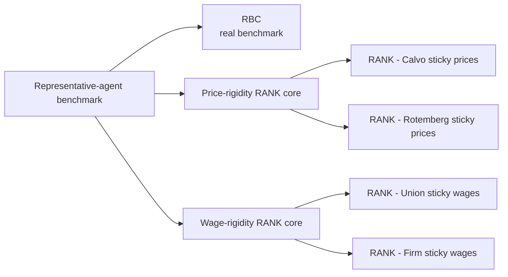
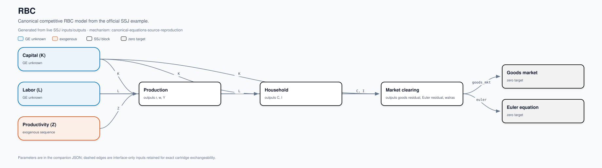
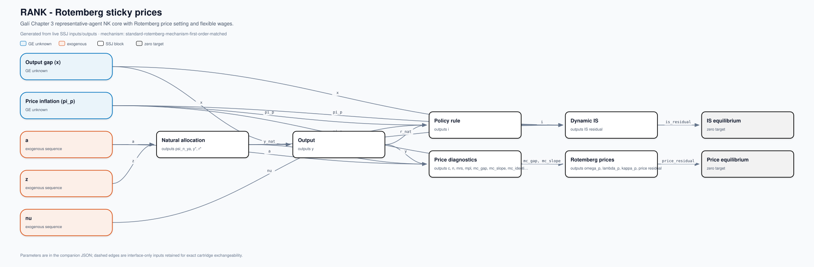
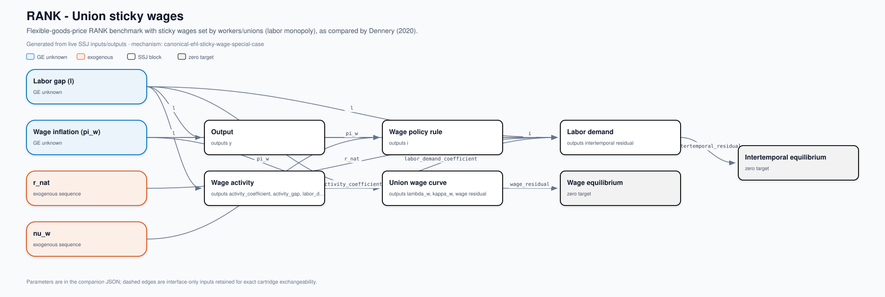
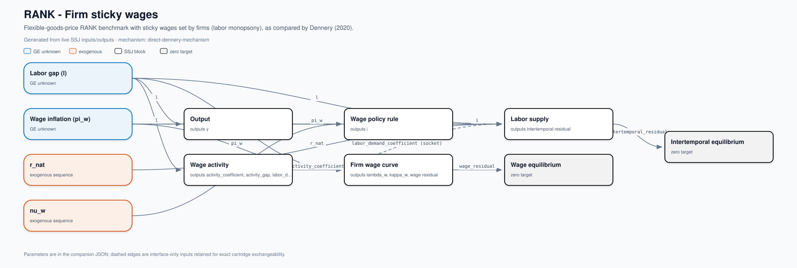

# Generated SSJ DAGs

Every figure below is generated from the live SSJ `inputs` and `outputs`
of its assembled model. Parameter values are recorded in JSON and omitted from
the visual arrows to keep the economic flows readable.

## Five-model ladder

The overview is a family map. The five detailed figures below are the
code-derived economic DAGs.

| Model | Blocks | Unknowns -> zero targets | Calibration status |
|---|---|---|---|
| **RBC** (`rbc`) | `rbc_firm`, `rbc_household`, `rbc_markets` | `K`, `L` -> `goods_mkt`, `euler` | `source-reproduction` |
| **RANK - Calvo sticky prices** (`rank_calvo_sticky_prices`) | `natural_allocation`, `output_identity`, `taylor_price`, `dynamic_is`, `price_core_diagnostics`, `price_calvo` | `x`, `pi_p` -> `is_residual`, `price_residual` | `canonical-textbook-calibration` |
| **RANK - Rotemberg sticky prices** (`rank_rotemberg_sticky_prices`) | `natural_allocation`, `output_identity`, `taylor_price`, `dynamic_is`, `price_core_diagnostics`, `price_rotemberg` | `x`, `pi_p` -> `is_residual`, `price_residual` | `standard-mechanism-matched-normalization` |
| **RANK - Union sticky wages** (`rank_union_sticky_wages`) | `wage_output`, `taylor_wage`, `wage_activity`, `labor_demand_monopoly`, `wage_pc_monopoly` | `l`, `pi_w` -> `intertemporal_residual`, `wage_residual` | `canonical-foundation-with-explicit-policy-closure` |
| **RANK - Firm sticky wages** (`rank_firm_sticky_wages`) | `wage_output`, `taylor_wage`, `wage_activity`, `labor_supply_monopsony`, `wage_pc_monopsony` | `l`, `pi_w` -> `intertemporal_residual`, `wage_residual` | `source-mechanism-empirically-anchored-calibration` |

## RBC

Canonical competitive RBC model from the official SSJ example.

Calibration: `official-ssj-rbc-reproduction` (`source-reproduction`).

## RANK - Calvo sticky prices

Galí Chapter 3 representative-agent NK core with Calvo price setting and flexible wages.

Calibration: `gali-chapter-3-calvo` (`canonical-textbook-calibration`).

## RANK - Rotemberg sticky prices

Galí Chapter 3 representative-agent NK core with Rotemberg price setting and flexible wages.

Calibration: `gali-chapter-3-rotemberg` (`standard-mechanism-matched-normalization`).

## RANK - Union sticky wages

Flexible-goods-price RANK benchmark with sticky wages set by workers/unions (labor monopoly), as compared by Dennery (2020).

Calibration: `ehl-sticky-wage-flexible-price` (`canonical-foundation-with-explicit-policy-closure`).

## RANK - Firm sticky wages

Flexible-goods-price RANK benchmark with sticky wages set by firms (labor monopsony), as compared by Dennery (2020).

Calibration: `dennery-monopsony-eta4` (`source-mechanism-empirically-anchored-calibration`).

